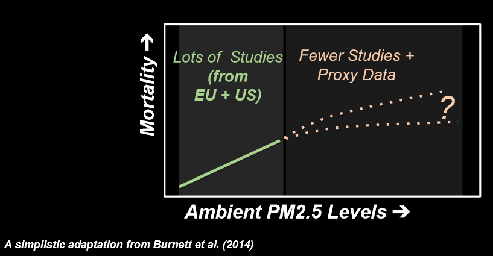

  
```{r setup, include=FALSE}
knitr::opts_chunk$set(echo = FALSE,
                      warning = FALSE,
                      message = FALSE, 
                      cache = TRUE)

library("dplyr")
library("ggmap")
library("ggplot2")
library("tidyr")
library("gganimate")
library("animation")
library("rworldmap")
library("viridis")
library("ggthemes")
```


```{r fireworks, cache = TRUE}
load( "data/4th_july.RData")

mintime <- lubridate::ymd_hms("2016 07 04 17 00 00")
maxtime <- lubridate::ymd_hms("2016 07 05 07 00 00")

measurements <- filter(measurements, 
                       hour >= mintime)
measurements <- filter(measurements, 
                       hour <= maxtime)

library("albersusa")
us <- usa_composite()
us_map <- fortify(us, region="name")
us_map <- filter(us_map, !id %in% c("Alaska", "Hawaii"))
gg <- ggplot()
gg <- gg + geom_map(data=us_map, map=us_map,
                    aes(x=long, y=lat, map_id=id),
                    color="white", size=0.1, fill="black")
gg <- gg + theme_map(base_size = 20)
gg <- gg + theme(plot.title = element_text(color="white"))
gg <- gg + theme(legend.position = "bottom")
gg <- gg + theme(panel.background = element_rect(fill = "black"))
gg <- gg + theme(plot.background=element_rect(fill="black"))
gg <- gg + theme(legend.background= element_rect(fill="black", colour= NA)) 
gg <- gg + theme(legend.text = element_text(colour="white"))
gg <- gg + theme(legend.title = element_text(colour="white"))


lala <- group_by(measurements, location, latitude) %>% summarize(n = n())

measurements <- group_by(measurements, location, latitude) %>%
  filter(n() == max(lala$n),
         latitude < 50, longitude > - 130) %>%
  ungroup()

minConc <- min(measurements$value, na.rm = TRUE)
maxConc <- max(measurements$value, na.rm = TRUE)
plotMap <- gg+
  geom_point(data = measurements, aes(x=longitude,
                                      y=latitude,
                                      frame=as.character(hour),
                                      colour = value,
                                      size = value))+
  coord_map()+
  viridis::scale_color_viridis(expression(paste("PM2.5 concentration (", mu, "g/",m^3,")Set to 80 if >80")),
                               option = "inferno") 
 

ani.options(interval = 0.5, ani.width = 800, ani.height = 550)

gg_animate(plotMap, "figs/fireworks.gif")
```

# Small case-study: Delhi, India 

## Delhi PM2.5 time series

```{r delhi hourly, fig.width = 10, fig.height = 6}
load("data/meas_india.RData")

table <- both %>% mutate(day = as.Date(dateLocal)) %>%
  filter(value > 0, value != 1985) %>%
  group_by(day, location) %>%
  summarize(PM25 = mean(value)) %>%
  ungroup()


 ggplot() +
  geom_line(data = table, aes(x = day,y = PM25), col = "goldenrod")+
  ylab(expression(paste("PM2.5 concentration (", mu, "g/",m^3,")")))+
   xlab("Time (days)")+
   theme_hc(bgcolor = "darkunica") +   scale_colour_hc("darkunica") +
  theme(text = element_text(size=20)) 
```

## Delhi PM2.5 vs. AQI categories


```{r delhi daily, fig.width = 10, fig.height = 6}


paletteAQI <- viridis::viridis_pal(option = "plasma")(6)
paletteAQI2 <- factor(paletteAQI,
                     levels = paletteAQI)
labels <- factor(c( "Good", "Satisfactory", "Moderately polluted",
                    "Poor", "Very Poor", "Severe"),
                 levels = c( "Good", "Satisfactory", "Moderately polluted",
                             "Poor", "Very Poor", "Severe"))

aqiPM <- data.frame(ymin = c(0, 30, 60, 90, 120, 250),
                    ymax = c(30, 60, 90, 120, 250, Inf),
                    col = paletteAQI2)


ggplot() +
  geom_rect(data = aqiPM, aes(xmin = table$day[1], xmax = max(table$day),
                              ymin = ymin, ymax = ymax,
                              fill = col), alpha = 0.7)  +
  scale_fill_manual(name="AQI Category PM.5",
                      breaks=paletteAQI,
                      values=paletteAQI,
                      labels=labels)+
  geom_line(data = table, aes(x = day,y = PM25))+
  ylab(expression(paste("PM2.5 concentration (", mu, "g/",m^3,")")))+
   xlab("Time (days)")+
   theme_hc(bgcolor = "darkunica") +   scale_colour_hc("darkunica") +
  theme(text = element_text(size=20), 
        legend.position = "bottom")

```

## Delhi PM2.5 vs. WHO limit

```{r delhi daily who, fig.width = 10, fig.height = 6}

ggplot() +
  geom_line(data = table, aes(x = day,y = PM25), 
             col = "goldenrod")+
  geom_hline(yintercept = 25, size = 1.2, col = "darkred") +
  ylab(expression(paste("PM2.5 concentration (", mu, "g/",m^3,")")))+
   xlab("Time (days)") +
   theme_hc(bgcolor = "darkunica") +   scale_colour_hc("darkunica")+
  theme(text = element_text(size=20))
```


## Delhi PM2.5 vs. Beijing PM2.5

```{r delhi beijing, fig.width = 10, fig.height = 6}

load("data/meas_china.RData")
cities <- bind_rows(meas_china, both)
cities <- cities %>% mutate(day = as.Date(dateLocal)) %>%
  filter(value > 0, value != 1985,
         day >= min(as.Date(meas_china$dateLocal))) %>%
  group_by(day, location, city) %>%
  summarize(PM25 = mean(value)) %>%
  ungroup()

ggplot() +
  geom_line(data = cities, aes(x = day,y = PM25),
             col = "goldenrod")+
  facet_grid(city ~ .) +
  geom_hline(yintercept = 25, size = 1, col = "darkred") +
  ylab(expression(paste("PM2.5 concentration (", mu, "g/",m^3,")")))+
   xlab("Time (days)")+
   theme_hc(bgcolor = "darkunica") +   scale_colour_hc("darkunica") +
  theme(text = element_text(size=20))
```

## Delhi PM2.5 vs. Barcelona PM2.5

```{r barcelona, fig.width = 10, fig.height = 6}
poblenou <- readr::read_csv("data/poblenou.csv") %>% mutate(city = "Barcelona")
names(poblenou)[2] <- "PM25"
delhi <- both%>% mutate(day = as.Date(dateLocal)) %>%
  filter(value > 0, value != 1985,
         day >= min(poblenou$day)) %>%
  group_by(day, location, city) %>%
  summarize(PM25 = mean(value)) %>%
  ungroup() %>%
  filter(city == "Delhi")
cities <- bind_rows(poblenou, delhi)

p <- ggplot() +
  geom_line(data = cities, aes(x = day,y = PM25),
            col = "goldenrod") +
  geom_hline(yintercept = 25, size = 1, col = "darkred") +
  ylab(expression(paste("PM2.5 concentration (", mu, "g/",m^3,")")))+
   xlab("Time (days)")+
   theme_hc(bgcolor = "darkunica") +   scale_colour_hc("darkunica") +
  theme(text = element_text(size=20))
p+
  facet_grid(city ~ .)
```

## Delhi PM2.5 vs. Barcelona PM2.5

```{r barcelona again, fig.width = 10, fig.height = 6}
p+
  facet_grid(city ~ ., scales = "free_y")

```

# Air inequality

```{r who map}

load("data/who_aq_data2.RData")
map.world <- map_data(map="world")
gg <- ggplot() + geom_map(data=map.world, map=map.world,
                          aes(map_id=region, x=long, y=lat),
                          fill = "grey60")
gg <- gg + theme_map(base_size = 20)
gg <- gg + theme(plot.title = element_text(color="white"))
gg <- gg + theme(legend.position = "bottom")
gg <- gg + theme(panel.background = element_rect(fill = "black"))
gg <- gg + theme(plot.background=element_rect(fill="black"))
gg <- gg + theme(legend.background= element_rect(fill="black", colour= NA)) 
gg <- gg + theme(legend.text = element_text(colour="white"))
gg <- gg + theme(legend.title = element_text(colour="white"))

dataPM25 <- mutate(data, PM25_year = floor(PM25_year)) %>%
  mutate(PM25_year = as.factor(PM25_year)) %>%
  filter(PM25_note == "measured data")

gg2 <- gg+
  geom_point(data = dataPM25,
             aes(x=longitude, y=latitude, col = PM25_year), size=2)+
  scale_color_viridis(option = "magma", discrete = TRUE) +
theme(plot.title = element_text(lineheight=1, face="bold"))

```

## WHO 2014

*1 out of 8 deaths* in the world due to air pollution.

## GDP vs. PM2.5

```{r gdp, fig.width = 11, fig.height = 7}
gdp_data <- readr::read_csv("data/gdp_data.csv")
gdp_data <- filter(gdp_data, !is.na(country))
gdp_data <- mutate(gdp_data, Country = ifelse(country == "Spain", "Spain", "Others"))
ggplot(gdp_data) +
  geom_point(aes(gdp, pm25, col = continent), size = 3) +
  scale_color_viridis(discrete = TRUE)+
  ylab(expression(paste("Annual mean PM2.5 concentration (", mu, "g/",m^3,")"))) +
  scale_x_log10()+
  scale_y_log10()+
  xlab("GDP per capita (USD)") +
   theme_hc(bgcolor = "darkunica") +   scale_colour_hc("darkunica")+
  theme(legend.position = "bottom", legend.title = element_blank())+
  theme(text = element_text(size=20))
```

## WHO 2016 report

```{r show map, fig.width = 10, fig.height = 6}
gg2+
  theme(text = element_text(size=20))
```


## PM2.5 and mortality



# Fighting air inequality

## We need data!


## Where are data?


## OpenAQ {data-background-iframe="https://openaq.org/map#/map?_k=s4dwvy"}


# Fireworks 4th of July

## Fireworks 4th of July


## Thank you!

* https://openaq.org/

* https://github.com/masalmon/databeersbcn


